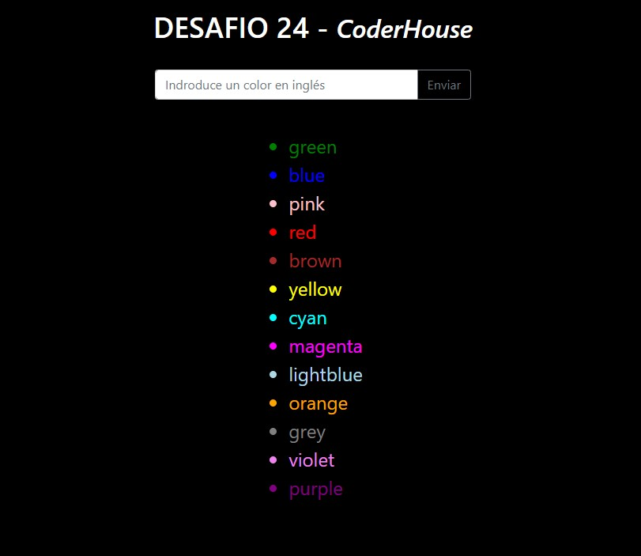

# Desafío 24 - Programación Backend

### CoderHouse

## SERVIDOR EN DENO

### Consigna

1. Crear un servidor que utilice el módulo http servest y genere la vista con React render.
2. Configurar denon para que, ante un cambio de código, el servidor de reinicie automáticamente.

   El servidor presentará en su ruta raíz un formulario de ingreso de un color, que será enviado al mismo por método post. Dicho color (en inglés) será incorporado a un array de colores persistido en memoria.

   Por debajo del formulario se deberán representar los colores recibidos en una lista desordenada (ul) utilizando el mismo color para la letra en cada caso. El color de fondo del la vista será negro.

**NOTA:** El servidor deberá tener extensión tsx para el correcto funcionamiento de la sintaxis de vista de React en Typescript.

### Ejecución

Configuré el script **start** de denon para que, ante un cambio de código, el servidor se reinicie automáticamente.

Para su ejecución (desarrollo) simplemente basta con ejecutar la siguiente línea

```sh
$ denon start
```

Internamente, denon ejecuta la sentencia

```sh
$ deno run --allow-net --allow-read --allow-env ./src/server.tsx
```

### Vistas

Existe la siguiente vista que provee una manera de probar el desafío.

- **/** : es la vista principal en donde se encuentra el formulario de ingreso de los colores. Por debajo se muestra el listado de colores recibidos.

### Detalles y comentarios

La consigna es simple, por lo que no hay mucho que agregar.

Realizo la importación y exportación de todas las dependencias del proyecto de manera centralizada en el archivo `deps.ts`

Utilizo el módulo de **dotenv** para tomar el puerto por variable de entorno en caso de existir.

Inicialmente construí el servidor **Deno** básico que se alojaba casi enteramente en el archivo `server.tsx` (primer commit).

Luego refactoricé el código para dividir este servidor en capas, aunque con simplificaciones ya que es un ejemplo básico (commit b1ece538).  
Para ello fue necesario importar algunos tipos extras para Typescript.
Generé los componentes de **React** en la carpeta `views/components` y los importe para renderizar dentro de la "plantilla principal" y mantener más ordenado el código.

Resultado:

<div align="center">
   
</div>
